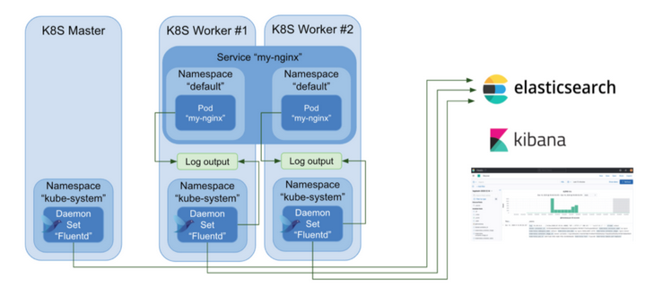

*********************************************************************
#### Stream Pod logs to Elasticsearch databases using FluentD
*********************************************************************
##### Fluentd introduced
*********************************************************************
[Fluentd](https://www.fluentd.org/) is an open source data collector for unified logging layer.
Fluent allows you to unify data collection and consumption for a better use and understanding of data.
---
Here is an illustration of how Fluent works in the k8s cluster:



Fluentd runs in the cluster as a [DaemonSet](https://kubernetes.io/docs/concepts/workloads/controllers/daemonset/). A DaemonSet ensures that all **nodes** run a copy of a **pod**. That way, Fluentd can collect log information from every containerized applications easily in each k8s node.

---
We will deploy the Fluentd chart to collect containers logs to send them to [Elasticsearch](https://www.elastic.co/what-is/elasticsearch) database.

---
1. Visit the Fluentd Helm chart at https://github.com/fluent/helm-charts/tree/main/charts/fluentd
---
2. Add the helm repo
```shell
# or update if you have it already: `helm repo update fluent`
helm repo add fluent https://fluent.github.io/helm-charts
```
---
3. Install the Fluentd chart by:
```shell
helm install fluentd fluent/fluentd
```
---
4. Watch and inspect the running containers under **Workloads** -> **DaemonSet**. Obviously, it doesn't work, as Fluent need to talk to an existed Elasticsearch database.
---
5. Elasticsearch db can be provisioned by applying `elasticsearch.yaml`.
---
6. Create a YAML file called `fluentd-helm-values.yaml`. You should override the [following](https://github.com/fluent/helm-charts/blob/main/charts/fluentd/values.yaml#L379) default Helm values, by:
```yaml
fileConfigs:
  04_outputs.conf: |-
    <label @OUTPUT>
      <match **>
        @type elasticsearch
        host "<elasticsearch-host>"
        logstash_format true
        port <elasticsearch-port>
      </match>
    </label>
```
While replacing `<elasticsearch-host>` and `<elasticsearch-port>` with the hostname of Elasticsearch int the cluster.

---
7. Finally, upgrade the `fluentd` release by `helm upgrade -f elastic-fluent/fluentd-helm-values.yaml fluentd fluent/fluentd`
*********************************************************************
### Visualize logs with Grafana
*********************************************************************
1. Review the objects in `grafana.yaml` and apply.
2. Visit grafana service (default username and password is `admin`) and configure the Elasticsearch database to view all cluster logs.

---

### Fluentd permissions in the cluster

---

Have you wondered how does the Fluentd pods have access to other pods logs!?

This is a great point to learn something about k8s role and access control mechanism ([RBAC](https://kubernetes.io/docs/reference/access-authn-authz/rbac/)).

---

#### Role and ClusterRole

---

_Role_ or _ClusterRole_ contains rules that represent a set of permissions on the cluster (e.g. This Pod can do that action..).
A Role always sets permissions within a particular _namespace_
ClusterRole, by contrast, is a non-namespaced resource.

---

#### Service account

---

A _Service Account_ provides an identity for processes that run in a Pod.
When you create a pod, if you do not specify a service account, it is automatically assigned the `default` service account in the same namespace.

---

#### RoleBinding and ClusterRoleBinding

A role binding grants the permissions defined in a role to a user or set of users.
A RoleBinding may reference any Role in the same namespace. Alternatively, a RoleBinding can reference a ClusterRole and bind that ClusterRole to the namespace of the RoleBinding.

---
Observe the service account used by the fluentd Pods, observe their ClusterRole bound to them.
*********************************************************************
##### [Return to main README](https://github.com/dmitriyshub/kube-hub)
*********************************************************************