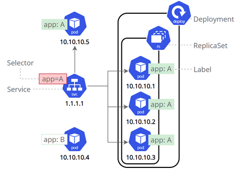

*********************************************************************
[Use a Service to Access an Application in a Cluster << K8s Tutorial Link](https://kubernetes.io/docs/tasks/access-application-cluster/service-access-application-cluster/)
*********************************************************************

*********************************************************************
##### Further reading and doing
Notes:
- _Using a service configuration file_ section (use YAML file instead `kubectl expose` command).
- Use `minikube ip` to get the IP of Minikube "node" and visit the app in `http://<NodeIP>:<NodePort>`
*********************************************************************
Services can be exposed in different ways by specifying a `type` in the ServiceSpec. We will review two types:
- `ClusterIP` (default) - Exposes the Service on an internal IP in the cluster. This type makes the Service only reachable from within the cluster.
- `NodePort` - Exposes the Service on some port of each **Node** in the cluster. Makes a Service accessible from outside the cluster using `<NodeIP>:<NodePort>`.
*********************************************************************
##### 1. Apply hello-app
```shell
kubectl apply -f hello-app.yaml
kubectl get deployments hello-world
kubectl describe deployments hello-world
```
*********************************************************************
##### 2. Add service
```shell
kubectl expose deployment hello-world --type=NodePort --name=example-service
kubectl describe services example-service
```
*********************************************************************